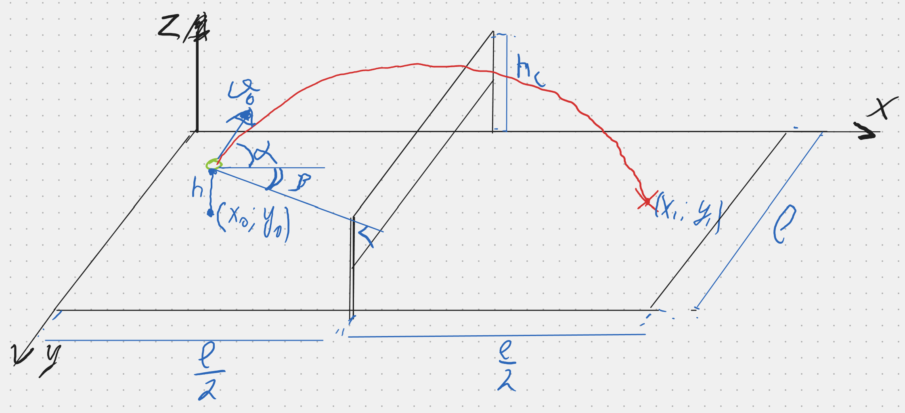
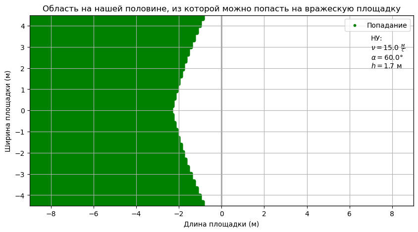

# Отчет по лабораторной работе №1 по Математическому Моделированию

## 1-2. Содержательная постановка задачи

### **$$\text{Задача о волейболистке}$$**

Разработать математическую модель, позволяющуюю описать полет мяча, отправленого игроком на площадку соперника. Модель должна позволять:

* Вычислять положение мяча в любой момент времени.
* Определять часть плащадки, из которой игрок попадает на територию противника

Исходные данные:

* угол $\alpha$ бросания мяча к горизонту и угол $\beta$ между линией сетки и линией броска

* начальная скорость мяча $\nu_0$

* высота, с которой совершается бросок $h$

* размеры площадки 18 на 9 метров
  
* высота сетки $h_c$ = 2.43 м

* масса мяча $m$



## 3. Концептуальная постанока задачи

Движение мяча может быть описаны в соответсвии с законами класической механики Ньютона. Применим следующие гипотезы:

* Объектом моделирования является волейбольный мяч

* Мяч будем считать материальной точкой массой $m$

* Движение происходит в поле силы тяжести с постоянным ускорением $g$

* Мы принебрегаем размерами мяча, сччитая его материальной точкой, сопротивлением воздуха и возмущениями, вызваными собственным вращением мяча вокруг центра масс

На основании гипотез имеем следующие выводы:
* В качестве параметров движения мяча используем его координаты $(x,y,z)$ и скорость его центра масс $V$ (соответствующие проекции $V_x, V_y, V_z$)
* Условием перелета мяча на площадку соперника считаем, что при некотором угле $\beta$ положение мяча при перелете через середину площадки должно быть выше сетки.
*  Для определения положения мяча в конечный момент времени полета необходимо найти зависимость координат $(x,y,z)$ и вектора скорости $V$ от времени $t$ и угла $\beta$. Будем считать, что пложение броска такое, что из него можно попасть на поле соперника, если конечные координаты мяча меньше пределов площадки ($x<L_x, y<L_y$, z=0).
## 4. Математическая постановка задачи
Математическую постановку задачи представим в координатной форме:

Найти зависимость $x(t), y(t)$ и $V_x(t), V_y(t), V_z(t)$ из решения системы дифференциальных уравнений:

$m \frac{\delta V_x}{\delta t} = 0, \quad V_x = \frac{\delta x}{\delta t}$

$m \frac{\delta V_y}{\delta t} = 0, \quad V_y = \frac{\delta y}{\delta t}$

$m \frac{\delta V_z}{\delta t} = -mg, \quad V_z = \frac{\delta z}{\delta t}$


При начальных условиях:

$x(t_0) = x, \quad  y(t_0) = y, \quad z(t_0) = z$

$x(t_c) = x_c, \quad y(t_c) = x_c sin(\beta) + y(y_0)$

$V_x(t_0) = V cos(\alpha)cos(\beta), \quad V_y(t_0) = V cos(\alpha)sin(\beta),  \quad  V_z(t_0) = V sin(\alpha)$

Вычислить параметр $z(t_c)$ и проверить условие $z(t_c)>h_c$

Вычислить параметры $t_{end}, x(t_{end}), y(t_{end})$ из условия $z(t_{end}) = 0$, проверить выполнение условия $x(t_{end})<L_x, y(t_{end})<L_y$

## 5. Реализация

### Техническое задание

* Проверка условий перелета мяча на поле соперника, нахождение координат поля, из которого можно попасть в поле соперника при заданных начальных условиях

* Программа должна определять область поля, из которого можно попасть на поле соперника. Для этого необходимы две функции, отвечающие следующим требованиям соответственно:
1. Расчет положения мяча при заданных начальных координатах, углах альфа и бета, моменте времени и начальной скорости.
2. Определение полное время полета мяча и  результат прохождения условий попадания мяча на базу противника.

* Управление режимами программы может проходить напрямую пользователем через задание начальных условий в коде программы

* Входные данные:
    - h0 - заданная высота броска,
    - alpha - заданный угол к горизонту
    - v - заданная скорость

* Выходные данные: 
    - Массивы координат поля, т.е. область, из которой мяч попадает на поля соперника.
    - График игрового поля, на котором цветом отмечена область, из которой можно совершить успешный бросок.


* Возможные ошибки пользователя при работе с программой:
    - Неверно введенные начальные условия (нереалистичные данные, как слишком большая скорость, высота, отрицательный угол у горизонту). Такие данные не приведут к ошибке выполнения программы, однако покажут неинформативный результат, так как они не соответствуют реальным физическим ситуациям. Для диагностики данной проблемы стоит заменить входные данные на реалистичные. 

### Програмная реализация метода 

```python
import numpy as np
import matplotlib.pyplot as plt
from IPython.display import HTML, display
import ipywidgets as widgets

  
v0=r'$\nu = $'
alpha1=r'$\alpha = $'
h1=r'$h = $'
ms=r'$\frac{м}{с}$'

def trajectory_2d(v, alpha, theta, t, x0, y0):
    alpha_rad = np.radians(alpha) 
    theta_rad = np.radians(theta)  
    x = x0 + v * np.cos(alpha_rad) * np.cos(theta_rad) * t
    y = y0 + v * np.cos(alpha_rad) * np.sin(theta_rad) * t
    z = h0 + v * np.sin(alpha_rad) * t - (g * t**2) / 2
    return x, y, z


def check_trajectory_2d(v, alpha, theta, x0, y0):
    alpha_rad = np.radians(alpha)
    t_flight = (v * np.sin(alpha_rad)+ np.sqrt((v * np.sin(alpha_rad))**2 + 2 * g * h0)) / g    
    t_net = (d - x0) / (v * np.cos(alpha_rad) *np.cos(np.radians(theta)))
    _, y_net, z_net = trajectory_2d(v, alpha, theta, t_net, x0, y0)
    if z_net < H:
        return False     
    x_land, y_land, _ = trajectory_2d(v, alpha, theta, t_flight, x0, y0)
    
    if x_land < d:
        return False 
    elif x_land > d + L:
        return False  
    elif abs(y_land) > W / 2:
        return False  
    else:
        return True 

g = 9.81  
d = 9.0   
L = 9.0   
W = 9.0 
H = 2.43
h0 =        # заданная высота броска
alpha =     # заданный угол к горизонту
v =         # заданная скорость
court_width = 9.0  
court_length = 9.0  
grid_size = 400  

x_positions = np.linspace(-court_length, 0, grid_size)
y_positions = np.linspace(-court_width / 2, court_width / 2, grid_size)
x_coords, y_coords = np.meshgrid(x_positions, y_positions)

successful_x = []
successful_y = []

for i in range(grid_size):
    for j in range(grid_size):
        x0 = x_coords[i, j]
        y0 = y_coords[i, j]
        for theta in range(-90, 90, 1): 
            if check_trajectory_2d(v, alpha, theta, x0, y0):
                successful_x.append(x0)
                successful_y.append(y0)
                break

fig, ax = plt.subplots(figsize=(10, 5))

ax.add_patch(plt.Rectangle((-court_length, -court_width / 2), court_length,\
     court_width, fill=False, color='black'))
ax.add_patch(plt.Rectangle((0, -court_width / 2), court_length,\
     court_width, fill=False, color='black'))

ax.scatter(successful_x, successful_y, color='green', s=10, label='Попадание')
ax.set_xlim(-court_length, court_length)
ax.set_ylim(-court_width / 2, court_width / 2)
ax.set_xlabel("Длина площадки (м)")
ax.set_ylabel("Ширина площадки (м)")
ax.set_title("Область на нашей половине, из которой можно попасть на вражескую площадку")

ax.text(7,2,f"НУ:\n{v0}{v} {ms}\n{alpha1}{alpha}°\n{h1}{H} м")
ax.legend()
plt.grid()
plt.show()
 
```
 
## 6. Качественный анализ задачи

С математической точки зрения задача свелась к задаче Коши для системы дифференциальных уравнений 1-го порядяка с заданными начальными условиями. 

Выполним контроль размерности задач:

$m\frac{\partial V_x}{\partial t}=mg \rightarrow [кг]\frac{м}{с^2}=[кг \frac{м}{с^2}]$
$V_x=\frac{\partial x}{\partial t} \rightarrow [\frac{м}{с}]=\frac{[м]}{[с]}=[\frac{м}{с}]$


$m\frac{\partial V_y}{\partial t}=mg \rightarrow [кг]\frac{м}{с^2}=[кг \frac{м}{с^2}]$
$V_y=\frac{\partial y}{\partial t} \rightarrow [\frac{м}{с}]=\frac{[м]}{[с]}=[\frac{м}{с}]$

$m\frac{\partial V_z}{\partial t}=mg \rightarrow [кг]\frac{м}{с^2}=[кг \frac{м}{с^2}]$
$V_z=\frac{\partial z}{\partial t} \rightarrow [\frac{м}{с}]=\frac{[м]}{[с]}=[\frac{м}{с}]$
## 7. Численное иследование модели

При исследовании задачи было получено следующее решение


