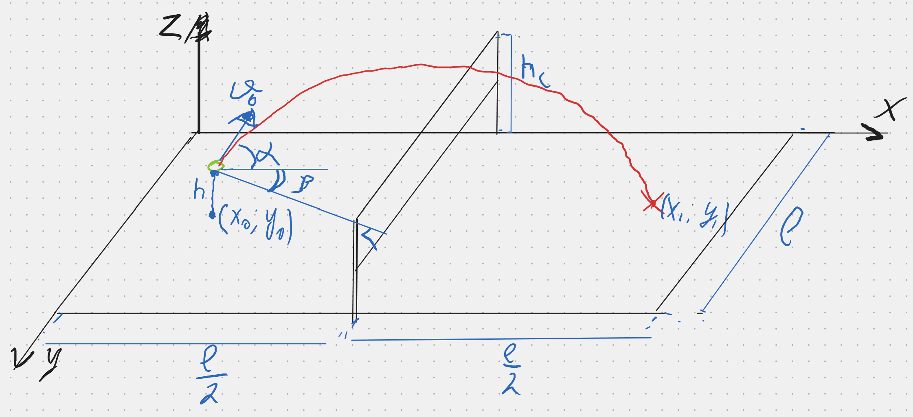

# Отчет по лабораторной работе №1 по Мат Моделированию

## 1-2. Содержательная постановка задачи

### **$$\text{Задача о волейболистке}$$**

Разработать математическую модель, позволяющуюю описать полет мяча, отправленого игроком на площадку соперника. Модель должна позволять:

* Вычислять положение мяча в любой момент времени.
* Определять часть плащадки, из которой игрок попадает на територию противника

Исходные данные:

* угол $\alpha$ бросания мяча к горизонту и угол $\beta$ между линией сетки и линией броска

* начальная скорость мяча $\nu_0$

* высота, с которой совершается бросок $h$

* размеры площадки 18 на 9 метров

* масса мяча $m$

## 3. Концептуальная постанока задачи

Движение мяча может быть описаны в соответсвии с законами класической механики. Примем следующие допущения:

* Мяч будем считать материальной точкой массой $m$

* Движение происходит в поле силы тяжести с постоянным ускорением $g$

* Мы принебрегаем сопротивлением воздуха и возмущениями, вызваными собственным вращением мяча вокруг центра масс

## 4. Математическая постановка задачи

## 5. Реализация

## 6. Качественный аннализ задачи

## 7. Численное иследование модели
