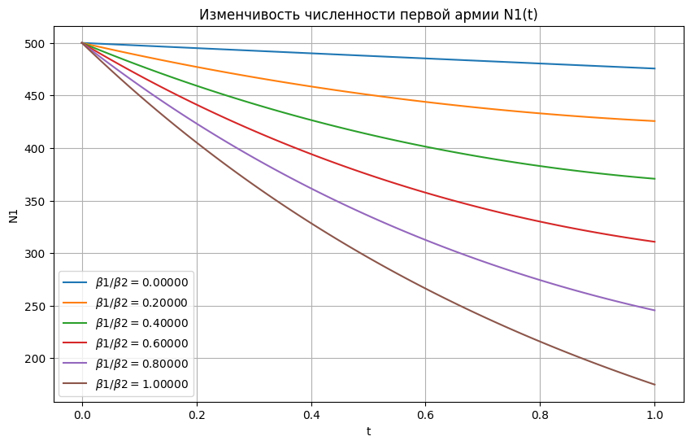
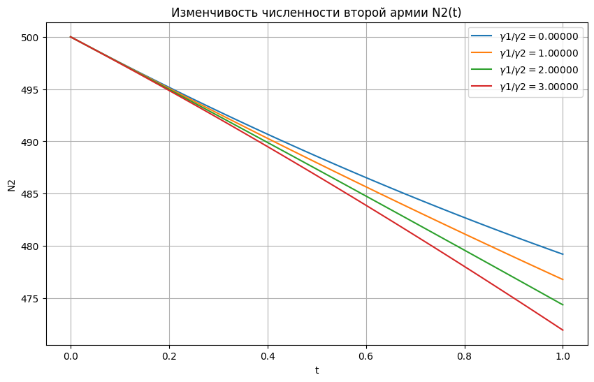
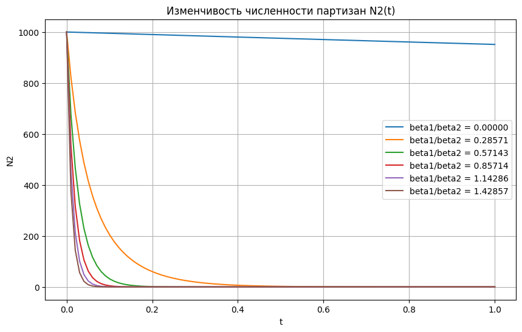
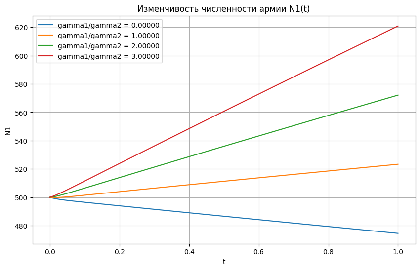

# Отчет по лабораторной работе №N по Мат Моделированию

## 1-2. Содержательная постановка задачи
## 1.1
Суть поставленной задачи:
Исследовать изменчивость численности первой армии $N_2(t) для соотношений темпов потерь из-за действий соперника($\beta_1 / \beta2$), а также исследовать изменчивость армии $N_2(t)$при условии получения подкрепления каждой армией ($\gamma_1 !=0 и \gamma_2 !=0)

## 1.2
Суть поставленной задачи:
Исследовать изменчивость численности партизан $N_2(t)$ для разных соотношений темпов потерь из-за действий соперника ($\beta_1 / \beta_2$), а так же исследовать изменчивость численности армии $N_1(t)$ при условии получения подкрепления армией (\gamma_1 != 0 и \gamma_2 !=0)
## 3. Концептуальная постанока задачи
## 3.1 и 3.2
Главной характеристикой противоборствующих сторон в рассматриваемой модели являются численности сторон $N_1(t) >=0 и N_2(t)>=0$. Если какой-то момент времени одна из численностей обращается в нуль, то данная сторона считается потерпевшей поражение (притом, что в этот момент численность другой стороны положительная).
В случае действий между регулярными частями динамика их численности определяется тремя факторами:
1.	Скоростью уменьшения состава из-за причин, непосредственно не связанных с боевыми действиями (болезни, травмы, дезертирство), которое учитывается коэффициентами $\alpha_1(t) и \alpha_2(t)$ соответственно;
2.	Темпом потерь, обусловленных боевыми действиями противоборствующей стороны (которые в свою очередь определяются качеством ее стратегии и тактики, уровнем морального духа и профессионализмом бойцов, вооружениями и т.д.), которое учитывается коэффициентами $\beta_1(t) и \beta_2(t)$ соответственно;
3.	Скоростью поступления подкреплений, которая считается некоторой заданной функцией времени $\gamma_1(t) и \gamma_2(t)$

## 4. Математическая постановка задачи
## 4.1
При этих предположениях для $N_1(t), N_2(t)$ получаем систему уравнений 
$$
\begin{cases}
    \frac{dN_1}{dt} = -\alpha_1(t) N_1 - \beta_2(t) N_2 + \gamma_1(t), \\
    \frac{dN_2}{dt} = -\alpha_2(t) N_2 - \beta_1(t) N_1 + \gamma_2(t),
\end{cases}
$$
из которой при заданных функциях $\alpha_i,\beta_i,\gamma_i$ (i=1,2) и начальных значениях $N_1(t_0) = N_1(0)$, $N_2(t_0)=N_2(0)$, однозначно определяется решение в любой момент времени t>0. Коэффициенты $\alpha_{1,2}>=0$ характеризуют скорости потерь в силу обычных (не боевых) причин, $\beta_{1,2}>=0$ - темпы потерь из-за действий соперника, $\gamma_{1,2}>=0$-скорости поступлений подкреплений

Используем модель Ланчестера 
$$
\begin{cases}
    \frac{dN_1}{dt} = -\alpha_1(t) N_1 - \beta_2(t) N_2 + \gamma_1(t), \\
    \frac{dN_2}{dt} = -\alpha_2(t) N_2 - \beta_1(t) N_1 + \gamma_2(t),
\end{cases}
$$
в частном случае:
1.$\gamma_1 = \gamma_2 = 0$(стороны не получают подкреплений и как бы предоставлены сами себе).
2.$\alpha_1 = const$,$\alpha_1 = const$,$\beta_1 = const$,$\beta_2 = const$ (последнее означает, в частности, что у противников всегда найдется достаточное количество вооружений, которое может использоваться годными к несению службы бойцам).
Модель становиться автономной и принимает вид 
$$
\begin{cases}
    \frac{dN_1}{dt} = -\alpha_1 N_1 - \beta_2 N_2, \\
    \frac{dN_2}{dt} = -\alpha_2 N_2 - \beta_1 N_1.
\end{cases}
$$
Из данной системы уравнений видно, что в данном случае численности сторон с течением времени могут только убывать

## 4.2
Темпы потерь партизан, проводящих операции в разных местах на некоторой территории, пропорционален не только численности армейких соединений $N_1(t), но и численности самих пратизан, т.е. определяется членом вида $\beta_1(t)*N_1(t)*N_2(t)$. В результате модель становится нелинейной:
$$
\begin{cases}
    \frac{dN_1}{dt} = -\alpha_1(t) N_1 - \beta_2(t) N_2 + \gamma_1(t), \\
    \frac{dN_2}{dt} = -\alpha_2(t) N_2 - \beta_1(t) N_1 N_2 + \gamma_2(t),
\end{cases}
$$
Все величины имеют тот же смысл, что и в модели боевых действий двух армий.
Коэффициенты $\alpha_{1,2}>=0$ характеризуют скорости потерь в силу обчных(не боевых) причин, $\beta_{1,2}>=0$ - темпы потерь из-за действий соперника, $\gamma_{1,2}>=0$ - скорости поступления подкреплений.

Рассмотрим теперь действия регулярной армии против партизан в тех же упрощениях, что и в предыдущем случае. Модель приобретает вид
$$
\begin{cases}
    \frac{dN_1}{dt} = - \beta_2 N_2, \\
    \frac{dN_2}{dt} = - \beta_1 N_1 N_2.
\end{cases}
Численности сторон, как и прежде, убывают со временем, но по другому закону.
$$
## 5. Реализация
## 5.1
```python
import numpy as np
import matplotlib.pyplot as plt
from scipy.integrate import odeint

def ode_n1_n2(N, t, alpha, beta, gamma):
    N1, N2 = N
    dN1 = -alpha[0] * N1 - beta[0] * N2 + gamma[0]
    dN2 = -alpha[1] * N2 - beta[1] * N1 + gamma[1]
    return [dN1, dN2]

alpha = [0.05, 0.05]
gamma = [0, 0]

plt.figure(figsize=(10, 6))
for beta1 in np.arange(0, 1.1, 0.2):
    beta = [beta1, 1.0]
    N0 = [500, 500] 
    t = np.linspace(0, 1, 100)  

    N = odeint(ode_n1_n2, N0, t, args=(alpha, beta, gamma))

    plt.plot(t, N[:, 0], label=f'$\\beta1/\\beta2 = {beta[0] / beta[1]:.5f}$')

plt.xlabel('t')
plt.ylabel('N1')
plt.title('Изменчивость численности первой армии N1(t)')
plt.legend()
plt.grid()
plt.show()

alpha = [0.05, 0.05]
beta = [0.1, 0.1]

plt.figure(figsize=(10, 6))
for gamma1 in np.arange(0, 151, 50):
    gamma = [gamma1, 50]
    N0 = [500, 500] 
    t = np.linspace(0, 1, 100) 

    N = odeint(ode_n1_n2, N0, t, args=(alpha, beta, gamma))

    plt.plot(t, N[:, 1], label=f'$\\gamma1/\\gamma2 = {gamma[0] / gamma[1]:.5f}$')

plt.xlabel('t')
plt.ylabel('N2')
plt.title('Изменчивость численности второй армии N2(t)')
plt.legend()
plt.grid()
plt.show()

```
## 5.2
```python
import numpy as np
import matplotlib.pyplot as plt
from scipy.integrate import odeint

def ode_n1_n2(N, t, alpha, beta, gamma):
    N1, N2 = N
    dN1 = -alpha[0] * N1 - beta[1] * N2 + gamma[0]  
    dN2 = -alpha[1] * N2 - beta[0] * N1 * N2 + gamma[1]  
    return [dN1, dN2]


alpha = [0.05, 0.05] 
gamma = [0, 0]  


plt.figure(figsize=(10, 6))
for beta1 in np.arange(0, 1.1, 0.2):
    beta = [beta1, 0.7] 
    N0 = [100, 1000]  
    t = np.linspace(0, 1, 100) 

    N = odeint(ode_n1_n2, N0, t, args=(alpha, beta, gamma))

    plt.plot(t, N[:, 1], label=f'beta1/beta2 = {beta[0] / beta[1]:.5f}')

plt.xlabel('t')
plt.ylabel('N2')
plt.title('Изменчивость численности партизан N2(t)')
plt.legend()
plt.grid()
plt.show()


plt.figure(figsize=(10, 6))
alpha = [0.05, 0.05]  
beta = [0.1, 0.1] 

for gamma1 in np.arange(0, 151, 50):
    gamma = [gamma1, 50] 
    N0 = [500, 500]
    t = np.linspace(0, 1, 100)

    
    N = odeint(ode_n1_n2, N0, t, args=(alpha, beta, gamma))

    
    plt.plot(t, N[:, 0], label=f'gamma1/gamma2 = {gamma[0] / gamma[1]:.5f}')

plt.xlabel('t')
plt.ylabel('N1')
plt.title('Изменчивость численности армии N1(t)')
plt.legend()
plt.grid()
plt.show()

```
## 6. Численное иследование модели
## 6.1


## 6.2

