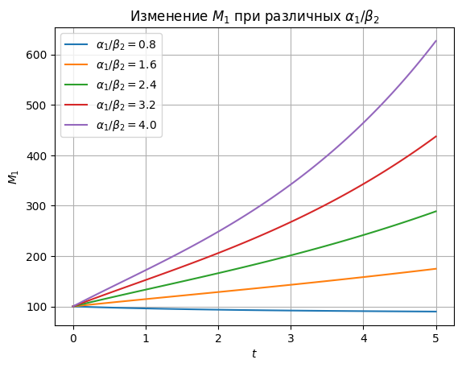
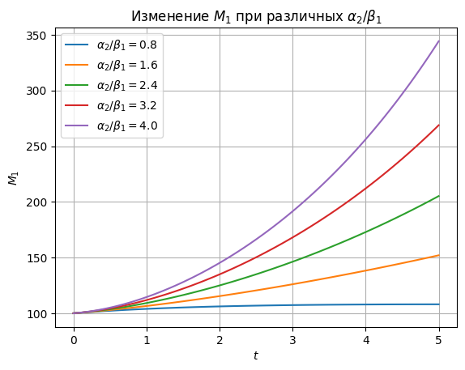
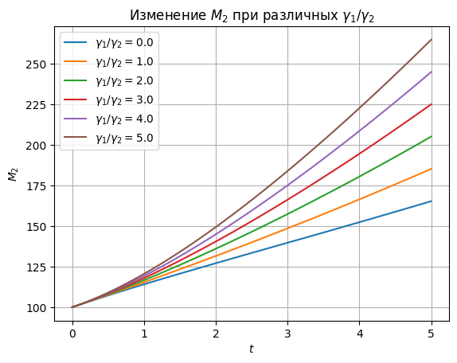

# Отчет по лабораторной работе №N по Мат Моделированию

## 1-2. Содержательная постановка задачи
Cуть задачи:
Исследовать изменчивость объема вооружения первой страны $M_1(t)$ для разных соотношений скорости наращивания и "старения" вооружений ($\alpha_1/\beta_2$; $\alpha_2/\beta_1$). Уровень взаимной настороженности(недоверия) конкурентов считать равным
А также исследовать объем вооружений второй страны $M_2(t)$ от соотношения условий взаимной настороденности(недоверия) конкурентов считать равным ($\gamma_1/\gamma_2)
## 3. Концептуальная постанока задачи
В 1918 г. английский метеоролог Льюис Ф. Ричардсон, служивший на фронте санитаром, вернулся с первой мировой войны потрясенный размерами виденных им разрушений и насилия.  Он был преисполнен решимости применить свои недюжинные математические способности и новейшие научные знания к изучению феномена войны. Поскольку первой мировой войне предшествовала гонка вооружений, Ричардсон обратился к рассмотрению этого явления.  Благодаря своим занятиям физикой он был хорошо знаком с дифференциальным исчислением, используемым при моделировании динамических процессов. Гонка вооружений, рассуждал он, тоже является динамическим процессом и может быть приблизительно описана с помощью математической модели.
Модель Ричардсона учитывает три фактора:
1.	Количество оружия у противника.
2.	Износ уже существующего вооружения.
3.	Степени недоверия между противниками.

## 4. Математическая постановка задачи
Темпы прироста и уменьшения вооружений пропорциональны указанным факторам, т.е.
$$ 
\left\{
\begin{array}{l}
\frac{dM_1}{dt} = -\alpha_1(t) M_2 - \beta_1(t) M_1 + \gamma_1(t) \\
\frac{dM_2}{dt} = -\alpha_2(t) M_1 - \beta_2(t) M_2 + \gamma_2(t)
\end{array}
\right.
$$ 
, где $M1(t) >=0, M_2>=0$ - объемы вооружений, коэффициенты $\alpha_{1,2}>0, \beta_{1,2}>0$ характеризуют скорости наращивания и «старения» вооружений (аналог процесса амортизации производственных мощностей в моделях экономики), функция $\gamma_{1,2}$ >0 описывают уровень взаимной настороженности (недоверия) конкурентов, который считается не зависящим от количества вооружений, а определяется другими причинами.
Модель не учитывает многие важные факторы, влияющие на динамику гонки вооружений, но тем не менее, дает возможность проанализировать ряд существенных свойств этого процесса. Анализ наиболее прост в частном случае, когда функции 
$\alpha_i, \beta_i, \gamma_i$ (i=1,2) не зависят от времени:
$$ 
\left\{
\begin{array}{l}
\frac{dM_1}{dt} = -\alpha_1 M_2 - \beta_1 M_1 + \gamma_1 \\
\frac{dM_2}{dt} = -\alpha_2 M_1 - \beta_2 M_2 + \gamma_2
\end{array}
\right.
$$ 
## 5. Реализация
```python
import numpy as np
import matplotlib.pyplot as plt
from scipy.integrate import odeint

def ode_M1_M2(M1_M2, t, alpha, beta, gamma):
    M1, M2 = M1_M2
    dM1 = alpha[0] * M2 - beta[0] * M1 + gamma[0]
    dM2 = alpha[1] * M1 - beta[1] * M2 + gamma[1]
    return [dM1, dM2]

beta = [0.25, 0.25]
gamma = [0.1, 0.1]
t = np.linspace(0, 5, 100)

plt.figure()
for alpha1 in np.arange(0.2, 1.2, 0.2):
    alpha = [alpha1, 0.3]
    M1_M2_0 = [100, 100]
    M1_M2 = odeint(ode_M1_M2, M1_M2_0, t, args=(alpha, beta, gamma))
    
    plt.plot(t, M1_M2[:, 0], label=f'$\\alpha_1/\\beta_2 = {alpha[0] / beta[1]:.1f}$')
    
plt.xlabel('$t$')
plt.ylabel('$M_1$')
plt.grid(True)
plt.legend()
plt.title('Изменение $M_1$ при различных $\\alpha_1/\\beta_2$')
plt.show()

plt.figure()
for alpha2 in np.arange(0.2, 1.2, 0.2):
    alpha = [0.3, alpha2]
    M1_M2_0 = [100, 100]
    M1_M2 = odeint(ode_M1_M2, M1_M2_0, t, args=(alpha, beta, gamma))
    
    plt.plot(t, M1_M2[:, 0], label=f'$\\alpha_2/\\beta_1 = {alpha[1] / beta[0]:.1f}$')
    
plt.xlabel('$t$')
plt.ylabel('$M_1$')
plt.grid(True)
plt.legend()
plt.title('Изменение $M_1$ при различных $\\alpha_2/\\beta_1$')
plt.show()

alpha = [0.3, 0.3]
beta = [0.25, 0.25]

plt.figure()
for gamma1 in range(0, 60, 10):
    gamma = [gamma1, 10]
    M1_M2_0 = [100, 100]
    M1_M2 = odeint(ode_M1_M2, M1_M2_0, t, args=(alpha, beta, gamma))
    
    plt.plot(t, M1_M2[:, 1], label=f'$\\gamma_1/\\gamma_2 = {gamma[0] / gamma[1]:.1f}$')
    
plt.xlabel('$t$')
plt.ylabel('$M_2$')
plt.grid(True)
plt.legend()
plt.title('Изменение $M_2$ при различных $\\gamma_1/\\gamma_2$')
plt.show()

```
## 7. Численное иследование модели


