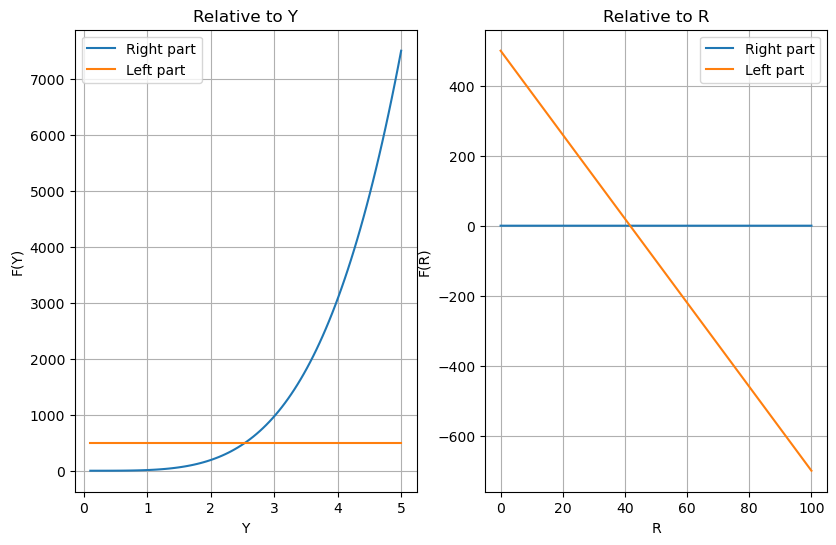

# Отчет по лабораторной работе №12 по Мат Моделированию

## 1-2. Содержательная постановка задачи

Суть поставленной задачи заключается в необходимости свести систему к одному уравнению относительно величины $Y$. Доказать существование решения полученного уравнения, основываясь на анализе графиков функций, входящих в его левую и правую части. 

Также, свести систему к одному уравнению относительно величины $s$. Доказать существование решения полученного уравнения, основываясь на анализе графиков функций, входящих в его левую и правую части.

## 3. Концептуальная постанока задачи

Математическая модель экономического равновесия строятся при следующих предположениях:

* Совершенная рыночная конкуренция, означающая отсутствие как крупных производственных корпораций, так и объединений работников, могущих диктовать свои условия для всей системы
* Неизменность производственных возможностей системы: оборудование, производственные помещения, технологии не изменяются со временем
* Неизменные во времени экономические интересы партнеров: предприниматели не пытаются увеличить свою прибыль, рабочие – зарплату, инвесторов устраивают проценты, получаемые по ценным бумагам, и т. д.
* Равновесие на рынке труда обеспичивается равенством предельного продукта труда и зароботной платы, скоректированной на уровень цен. $\frac{\partial F(R)}{\partial R}=\frac{s}{p}$

## 4. Математическая постановка задачи

Первый макропоказатель системы - национальный доход $Y$

Соотношение $Y=F(R)$ определяет связь между рынками труда и доходом $Y$

Если записать изменение последнего уравнения на $\Delta$ в дифференциальной форме, то получим
$\frac{\partial Y}{\partial R}=\frac{s}{p}$ или $\frac{\partial F(R)}{\partial R}=\frac{s}{p}$, где s - зароботная плата работника

Произведенный продукт частично потребляется, частично сберегается $S(Y)=y-\omega(Y)$

При этом функции $\omega(Y)$ и $F(R)$ обладают свойством насыщения: 
чем больше выпуск, тем меньшая доля дополнительного выпуска $\Delta Y$ ($\Delta R$) тратится на потребление и тем большая доля сберегается.

В условиях равновесия предложение фондообразующего продукта S(Y) сбалансировано со спросом на инвестиции $А(r)$: $S(Y)=A(r)$ или, учитывая $S(Y)= Y-\omega(Y)$: $A(r)=Y-\omega(Y)$ 


Считается, что деньги выпускает государство, и их количество (предложение) $Z$ является заданным управляющим параметром системы. Относительно спроса на деньги делается следующее предположение: спрос на деньги представляет собой сумму операционного и спекулятивного спроса.

Спекулятивный спрос задаётся функцией $I(r)$ такой, что $\frac{\partial I(r)}{\partial r}<0$ при $r>r_1$ и $I(r)$ резко возврастает при $r \rightarrow r_1$

Так как финансовый рынок находится в равновесии, то баланс денег в системе определяется уравнением: $Z=\tau p Y+I(r)$

Объеденяя все уравнения получим математическую систему рыночного равновесия:

$$
\begin{cases}
Y=F(R)\\
\frac{\partial F(R)}{\partial R}=\frac{s}{p}\\
A(r)=Y-\omega(Y)\\
Z=\tau p Y+I(r)
\end{cases}
$$

Выразим $R,p,r$:

$r=A^{-1}(Y-\omega (Y))$
$p=\frac{s}{\frac{\partial F(R)}{\partial R}}$
$R=F^{-1}(Y)$

Окончательное уравнение относительно переменной $Y$
$$Z-I(A^{-1}(Y-\omega(Y)))=\tau \frac{sY}{\frac{\partial F}{\partial R}(F^{-1}(Y))}$$

Окончательное уравнение относительно переменной $R$
$$Z-I(A^{-1}(F(R)-\omega(F(R))))=\tau \frac{sF(R)}{\frac{\partial F}{\partial R}R}$$

## 5. Реализация

```python
import numpy as np
import matplotlib.pyplot as plt

def F(R):
    return R**(1/4)

def dF(R):
    return 1 / (4*R**(3/4))

def w(Y):    
    return np.sqrt(Y)

def g(Y):    
    return Y - w(Y)

def A_inv(r):
    return np.where(r > r1, 0, -10 * (r - r1))

def F_inv(R):
    return R**4

def dF_inv(R):    
    return 4*R**3

def I(r):    
    return np.where(r < r2, 0, 8 / (r - r2))


Z = 500
tau = 1.2
s = 2.5
r2 = 2
r1 = 10
plt.figure(figsize=(15,6))
plt.subplot(1,3,1)
Y = np.linspace(0.1, 5, 100)
plt.plot(Y, tau * Y * s / dF(F_inv(Y)), label='Right part')
plt.plot(Y, Z - I(A_inv(Y - w(Y))), label='Left part')
plt.legend(loc = 'best')
plt.xlabel('Y')
plt.ylabel('F(Y)')
plt.title('Relative to Y')
plt.grid()


plt.subplot(1,3,2)
R = np.linspace(0, 100, 100)
plt.plot(R, I(A_inv(F(R) - w(F(R)))),label='Right part')
plt.plot(R, Z-tau*s*F(R)/dF(R), label='Left part')
plt.legend()
plt.xlabel('R')
plt.ylabel('F(R)')
plt.title('Relative to R')
plt.grid()

```


## 7. Численное иследование модели



Так как кривые на графиках, отображающие левую и правую части уравнений пересекаются в одной точке, то, в силу монотонности функций, можно утверждать, что модель имеет единственное решение, описывающее равновесное состояние экономики.