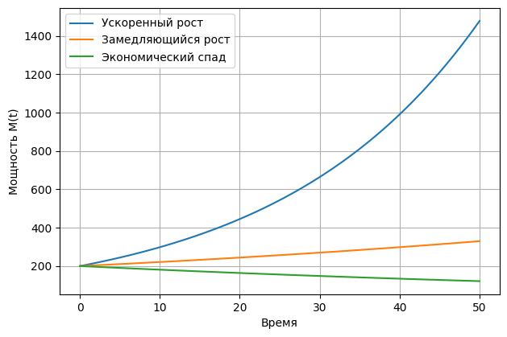
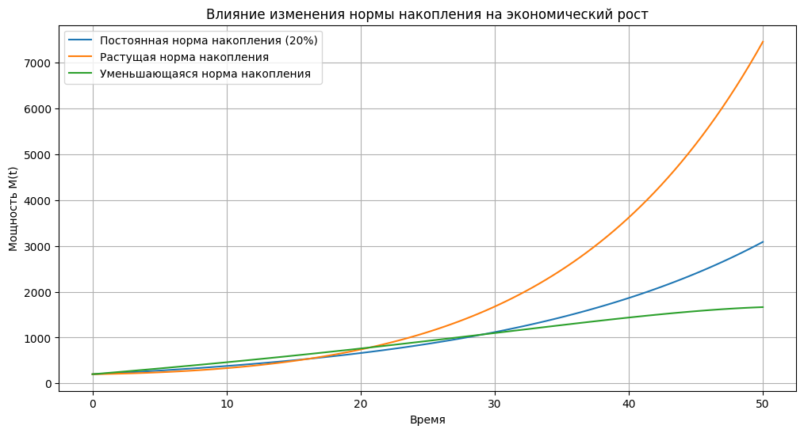

# Отчет по лабораторной работе №N по Мат Моделированию

## 1-2. Содержательная постановка задачи
## 1.1
Суть поставленной задачи:
Найти число работающих и соотношение между потреблением и накоплением, при которых душевое потребление работников максимально, а также норму накопления, обеспечивающая максимальное душевое потребление работников
## 1.2
Суть поставленной задачи:
Определить при каких предположениях относительно начальных состояний системы будет наблюдаться ускоренный экономический рост; замедляющийся экономический рост; экономический спад. Для наглядности нужно построить соответствующие траектории на основе аналитиеского решения, а также исследовать экономический рост при изменении нормы накопления A(t).
## 3. Концептуальная постанока задачи
## 3.1 и 3.2
Рассматривать будем несколько упрощенную модель, в которой темп прироста занятых работников принимаем пропрциональным числу работающих. В этой модели работник производят национальный доход, который идет на потреление и частично на накопление
$Y(t) = \omega(t) + A(t)$.  В свою очередь сбереженный в единицу времени продукт $A(t)$ расходуется на создание новой мощности.
## 4. Математическая постановка задачи
## 4.1
Число работающих с течением времени R(t) описывается экспоненциальным ростом: $R(t)=R_0e^{\alpha t}$
Мощность M(t) изменяется с темпоп $\gamma - \beta$. Реальный выпуск продукта зависит, естественно, от числа работающих и задается производственной функцией вида $Y(t)=M(t)*f(x(t))$, $x(t)=\frac{R(t)}{M(t)}$. Душевое потребление в свою очередь выражается величиной 
$c(t)=\frac{\omega(t)}{R(t)}$
Сбереженный в единицу времени продукт A(t) расходуется на создание новой мощности:
$A(t)=\alpha I(t)$, где $\alpha$>0 - сичтающееся заданным и постоянным количество фондообразующего продукта, необходимое для создания единицы новой мощности, I(t) - число единиц новой мощности.
Темп выбытия существующей мощности предполагается пропорциональным величине самой мощности, т.е. величине $\beta M(t)$, коэффициент выбытия $\beta>0$ задается постоянным.
В итоге для изменения функции M(t) получаем балансное соотношение $\frac{dM(t)}{dt} = I(t) -\beta M(t)$
Для замыкания модели предположим, что скорость введения новой мощности пропрциональна величине уже существующей мощности:
$I(t)=\gamma M(t)$, где $\gamma>0$(величина, обратная характерному времени наращивания мощности) считается заданной и постоянной (естественно, $\gamma>\beta$). Тогда:$M(t)=M_0*exp((\gamma-\beta)t)$, а вместе с ним определяются и все остальные неизвестные величины.

## 4.2
Действовать будем из следующих предположениях($\gamma$ - темп роста ресурсов, $\beta$ - коэффициент выбытия):
* Если $\gamma$ > $\beta$, темп роста превышает темп потерь, и ресурсы увеличиваются.
* Если $\gamma$ < $\beta$, темп потерь превышает темп роста, и ресурсы уменьшаются.
* Если $\gamma$ $\approx$ $\beta$, темп роста превышает темп потерь, и ресурсы стагнируют.
Соответственно этим коэффициентам зададим функции, описанные в тексте для 4.1

ВТорой пункт будем рассматривать в трех сценариях:
1. Постоянная норма накопления A(t)=const:
A(t)=s
2. Растущая норма накопления A(t):
A(t)=b + kt, k>0
3. Убывающая норма накопления A(t):
A(t)=b + kt, k<0
## 5. Реализация
## 5.1
```python
import numpy as np

alpha = 0.2
beta = 0.3
gamma = 0.4
R0 = 4
M0 = 20

def f(x):
    return np.sqrt(0.03 * x)

c = 0
A_m = 0
R_m = 0
w_m = 0

for t in range(51):
    R = R0 * np.exp(alpha * t)
    M = M0 * np.exp((gamma - beta) * t)
    
    x = R / M
    Y = M * f(x)
    A = alpha * gamma * M
    w = Y - A
    
    if w / R > c:
        c = w / R
        A_m = A
        R_m = R
        w_m = w

print(f"Число работающих R = {R_m:.0f}")
print(f"Соотношение между потреблением и накоплением w/A = {w_m / A_m:.5f}")

print(f"Норма накопления A/Y = {A_m / (w_m + A_m):.5f}")

```

## 5.2
```python
import numpy as np
import matplotlib.pyplot as plt

alpha = 0.05  
beta = 0.03
gamma_accelerated = 0.07  
gamma_slow = 0.04 
gamma_decline = 0.02 
R0 = 100  
M0 = 200  
t = np.linspace(0, 50, 100)


def M(t, gamma):
    return M0 * np.exp((gamma - beta) * t)


def R(t):
    return R0 * np.exp(alpha * t)


def f(x):
    return np.minimum(x, 1)


M_accelerated = M(t, gamma_accelerated)
M_slow = M(t, gamma_slow)
M_decline = M(t, gamma_decline)


R_values = R(t)


x_accelerated = R_values / M_accelerated
x_slow = R_values / M_slow
x_decline = R_values / M_decline


Y_accelerated = M_accelerated * f(x_accelerated)
Y_slow = M_slow * f(x_slow)
Y_decline = M_decline * f(x_decline)


s = 0.2 
A_accelerated = s * Y_accelerated
A_slow = s * Y_slow
A_decline = s * Y_decline


plt.figure(figsize=(12, 8))


plt.subplot(2, 2, 1)
plt.plot(t, M_accelerated, label="Ускоренный рост")
plt.plot(t, M_slow, label="Замедляющийся рост")
plt.plot(t, M_decline, label="Экономический спад")
plt.xlabel("Время")
plt.ylabel("Мощность M(t)")
plt.grid(True)
plt.legend()
plt.tight_layout()
plt.show()

```

```python
import numpy as np
import matplotlib.pyplot as plt

alpha = 0.05 
gamma = 0.06 
beta = 0.03  
R0 = 100  
M0 = 200  
t = np.linspace(0, 50, 100)  


def f(x):
    return np.minimum(x, 1)

def R(t):
    return R0 * np.exp(alpha * t)

def A_constant(t, s=0.2):
    return s * np.ones_like(t)

def A_increasing(t):
    return 0.1 + 0.01 * t 

def A_decreasing(t):
    return 0.3 - 0.005 * t 


def M_with_savings(t, A_func):
    M = np.zeros_like(t)
    M[0] = M0
    for i in range(1, len(t)):
        dt = t[i] - t[i-1]
        Y = M[i-1] * f(R(t[i]) / M[i-1])
        M[i] = M[i-1] + dt * (A_func(t[i]) * Y - beta * M[i-1])
    return M

M_constant = M_with_savings(t, A_constant)
M_increasing = M_with_savings(t, A_increasing)
M_decreasing = M_with_savings(t, A_decreasing)

plt.figure(figsize=(12, 6))

plt.plot(t, M_constant, label="Постоянная норма накопления (20%)")
plt.plot(t, M_increasing, label="Растущая норма накопления")
plt.plot(t, M_decreasing, label="Уменьшающаяся норма накопления")
plt.xlabel("Время")
plt.ylabel("Мощность M(t)")
plt.title("Влияние изменения нормы накопления на экономический рост")
plt.grid(True)
plt.legend()

plt.show()

```
## 7. Численное иследование модели
## 7.1
```
Число работающих R = 80
Соотношение между потреблением и накоплением w/A = 1.04978
Норма накопления A/Y = 0.48786
```
## 7.2


