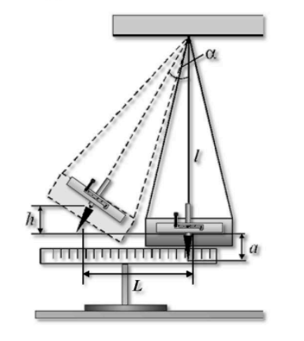
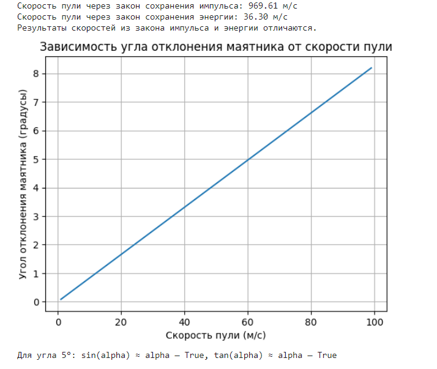

# Отчет по лабораторной работе №2 по Мат Моделированию

## 1-2. Содержательная постановка задачи

#### Объект исследования: 

Объект исследования - система "маятник-пуля". Практическая задача - определение скорости пули, по величине отклонения маятника. В рамках исследуемого процесса, к маятнику прикреплено орудие, которое совершает выстрел в горизонтальном направлении.

#### Содержательная постановка задачи:

Модель должна давать количественный ответ - скорость, с которой была выпущена пуля из орудия.

Не имея под рукой специальной лаборатории, воспользуемся для определением скорости пули относительно простым устройством - баллистическим маятником.

Для построения модели воспользуемся двумя фундаментальными законами природы - законом сохранения энергии и законом сокранения импульса.

Входные параметры:

* $M$ - совокупная масса орудия и маятника, $m$ - масса пули.
* $l, L$ - длина нити маятника, и максимальная величина смещения маятника по горизонтали.
* $M$, $m$ и $l$ известны до запуска пули, и определяются из характеристик установки. $L$ определяется в результате выстрела. Однако в рамках модели эти параметры удобно учитывать однородно.

Выходной параметр:
* Начальная скорость пули $u$.

## 3. Концептуальная постанока задачи



Рассмотрим решение поставленной задачи в рамках классической механики.
Применим следующие гипотезы:
* Считаем систему замкнутой в горизонтальном направлении
* Вектор скорости пули должен быть направлен в направлении оси x, по прямой, проходящей через центр тяжести маятника с орудием. Последние условие может выполниться лишь приближенно, для этого характерный размер маятника должен быть на порядок меньше длины нити.
* Время выстрела должно быть заметно меньше периода собственных колебаний маятника.
* На практике условия обеспечиваются выбором достаточно длинной нити подвеса маятника.

Таким образом, баллистический маятник - прибор, применяемый для измерения начальных скоростей пули или снаряда. В данном случае он представляет из себя тяжелый металлический цилиндр, заполненный вязким веществом и подвешенный на четырех нерастяжимых нитях. К цилиндру сбоку прикреплено простое пружинное орудие. В результате выстрела по закону отдачи маятник с орудием приобретают некоторую начальную скорость, и затем отклоняются на некоторое расстояние. По этому расстоянию можно определить скорость пули.


## 4. Математическая постановка задачи

Пуля массой m, вылетая со скоростью $v$, сообщит маятнику с орудием по закону отдачи кинетическую энергию $\frac {u^2m} {2}$. В результате отклонения маятник с орудием поднимется на высоту $h$, определяемую из закона сохранения механической энергии $Mgh=\frac {u^2m} {2}$. Отсюда:
$$u = \sqrt{\frac {2M}{m}gh}$$

Определим зависимость высоты $h$ от отклонения L. Ее можно выразить через угол отклонения $\alpha$:

$$h = l(1 - \cos\alpha) = 2l\sin^2\frac{\alpha}{2}$$

Виду того, что длина нитей l на порядок превосходит смещение маятника L, и угол отклонения маятника достаточно мал, то можно воспользоваться эквивалентностью:

$$\sin\frac{\alpha}{2}\approx \frac{\alpha}{2}
\approx \frac {tg\alpha}{2}=\frac {L}{2l}$$

Таким образом, высота $h$ приближенно равна:

$$h\approx\frac {L^2}{2l}$$

Итоговый вид зависимости скорости пули от отклонения примет вид:

$$u=L\sqrt{\frac{Mg}{ml}} $$

#### Закон сохранения энергии и закон сохранения импульса.
В начальный момент времени маятник с орудием приобретают скорость $V$. Она определяется из уравнения закона сохранения энергии:
$$M\frac{V^2}{2}=Mgh \\
 V = \sqrt{2gh}\approx L\sqrt{\frac{g}{l}}$$

 Скорость полета пули находится из закона сохранения импульса, при условии, что на систему не действуют внешние силы:

 $$mu=MV \\
 u \approx \frac {M}{m}L\sqrt{\frac {g}{l}}$$

## 5. Реализация
```python
import math
import matplotlib.pyplot as plt


def velocity_by_momentum(m_p, M, v_M):
    return M*math.sqrt(2*L*(1-math.cos(math.radians(alpha))))/m_p


def velocity_by_energy(m_p, M, L, alpha):
    g = 9.81
    h = L * (1 - math.cos(math.radians(alpha)))
    return math.sqrt((2 * M * g * h) / m_p)


def angle_vs_velocity(m_p, M, L, v_p_range):
    g = 9.81
    angles = []
    for v_p in v_p_range:

        ratio = (m_p * v_p**2) / (2 * M * g * L)
        if ratio <= 2:
            alpha = math.degrees(math.acos(1 - ratio))
            angles.append(alpha)
        else:
            angles.append(None)
    return angles

def small_angle_approximation(alpha_degrees):
    alpha_radians = math.radians(alpha_degrees)
    sin_approx = math.isclose(math.sin(alpha_radians), alpha_radians, rel_tol=1e-2)
    tan_approx = math.isclose(math.tan(alpha_radians), alpha_radians, rel_tol=1e-2)
    return sin_approx, tan_approx


m_p = 0.01
M = 70.0
L = 7.0
alpha = 3


v_M = math.sqrt(2 * 9.81 * L * (1 - math.cos(math.radians(alpha))))


v_p_momentum = velocity_by_momentum(m_p, M, v_M)
print(f"Скорость пули через закон сохранения импульса: {v_p_momentum:.2f} м/с")


v_p_energy = velocity_by_energy(m_p, M, L, alpha)
print(f"Скорость пули через закон сохранения энергии: {v_p_energy:.2f} м/с")


if math.isclose(v_p_momentum, v_p_energy, rel_tol=1e-2):
    print("Результаты скоростей из закона импульса и энергии совпадают.")
else:
    print("Результаты скоростей из закона импульса и энергии отличаются.")


v_p_range = range(1, 100, 1)
angles = angle_vs_velocity(m_p, M, L, v_p_range)


valid_v_p_range = [v for v, a in zip(v_p_range, angles) if a is not None]
valid_angles = [a for a in angles if a is not None]

plt.plot(valid_v_p_range, valid_angles)
plt.xlabel('Скорость пули (м/с)')
plt.ylabel('Угол отклонения маятника (градусы)')
plt.title('Зависимость угла отклонения маятника от скорости пули')
plt.grid(True)
plt.show()


alpha_test = 5  #это в градусах
sin_approx, tan_approx = small_angle_approximation(alpha_test)
print(f"Для угла {alpha_test}°: sin(alpha) ≈ alpha — {sin_approx}, tan(alpha) ≈ alpha — {tan_approx}")

```
## 6. Качественный анализ задачи

С математической точки зрания задача свелась к решению пары линейных уравнений, по одному для каждого метода.

Из закона сохранения энергии:

$$u=\sqrt{\frac{M}{m}}L\sqrt{\frac{g}{l}} $$

Из законов сохранения импульса и энергии:

$$u = \frac {M}{m}L\sqrt{\frac {g}{l}}$$

#### Контроль размерности уравнений:

$$u=\sqrt{\frac{M}{m}}L\sqrt{\frac{g}{l}} ⇒ \left[\frac{м}{с}\right] = \sqrt{\left[\frac{кг}{кг}\right]} \left[м\right] \sqrt{\left[\frac{м/с^2}{м}\right]} ⇒ \left[\frac{м}{с}\right] = \left[\frac{м}{с}\right]$$

$$u=\frac{M}{m}L\sqrt{\frac{g}{l}} ⇒ \left[\frac{м}{с}\right] = \left[\frac{кг}{кг}\right] \left[м\right] \sqrt{\left[\frac{м/с^2}{м}\right]} ⇒ \left[\frac{м}{с}\right] = \left[\frac{м}{с}\right]$$


## 7. Численное иследование модели
При исследовании задачи было получено следующее решение

