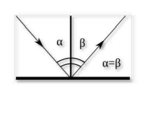
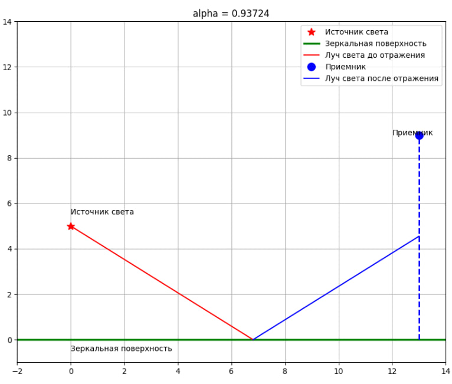
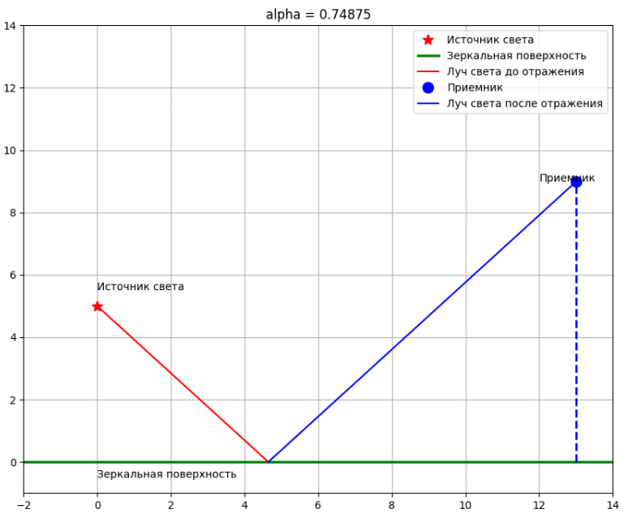
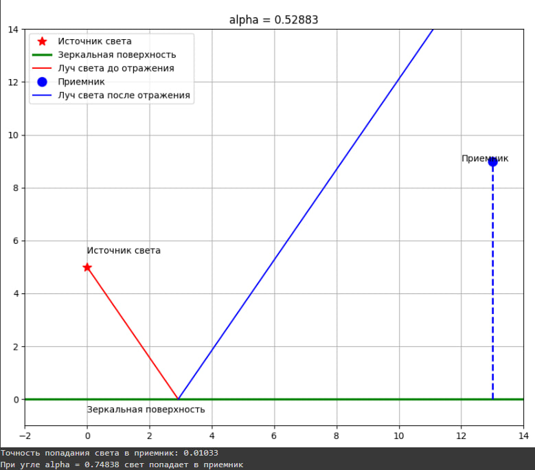

# Отчет по лабораторной работе №4.1 по Мат Моделированию

## 1-2. Содержательная постановка задачи
Необходимо разработать и описать математическую модель отражения света от зеркальной поверхности. 
*	Определить точность попадания света в приемник при различных начальных параметрах;
*	Вычислить значение вариационной переменной, при котором свет попадает в приемник.


Исходные данные:
* Угол падения $\alpha$
* Координаты источника света (0,b);
* Координаты приемника (d,h).

## 3. Концептуальная постанока задачи

Примем в качестве света точечный источник, а в качестве приемника - материальную точку. Воспользуемся законом отражения: отраженный и падающий лучи лежат в плоскости, содержащей перпендикуляр к отражающей поверхности в точке падения, и угол падения равен углу отражения

## 4. Математическая постановка задачи

Точка, в которую падает луч, имеет координаты $(b*\tan{(\alpha)}, 0)$. Уравнения для луча падения и отражения задаются соответственно: $y=-ctg(\alpha)*x +b$  и $y=ctg(\alpha)*x -b$. Угол, при котором отраженный луч попадает в приемник, можно вычислить геометрически: $\alpha = arctg(\frac{d}{b+h})$

## 5. Реализация
```python
import numpy as np
import matplotlib.pyplot as plt

def plot_light_reflection(b, d, h, alpha_start, alpha_end, alpha_step):
    """
    b: высота источника света
    d: расстояние до приемника
    h: высота приемника
    alpha_start: начальный угол падения света
    lpha_end: конечный угол падения света
    alpha_step: шаг изменения угла
    """
    res = []

    for alpha in np.arange(alpha_start, alpha_end, alpha_step):
        plt.figure(figsize=(10, 8))


        plt.plot(0, b, 'r*', markersize=10, label='Источник света')
        plt.xlim(-2, 14)
        plt.ylim(-1, 14)
        plt.grid(True)


        plt.plot([-2, 14], [0, 0], 'g', linewidth=2.5, label='Зеркальная поверхность')


        x1 = np.linspace(0, b * np.tan(alpha), 100)
        y1 = -x1 / np.tan(alpha) + b
        plt.plot(x1, y1, 'r', label='Луч света до отражения')


        plt.plot([d, d], [0, h], 'b--', linewidth=2)
        plt.plot(d, h, 'ob', markersize=10, label='Приемник')


        x2 = np.linspace(b * np.tan(alpha), d, 100)
        y2 = x2 / np.tan(alpha) - b
        plt.plot(x2, y2, 'b', label='Луч света после отражения')


        res.append(d / np.tan(alpha) - b)

        plt.text(0, 5.5, 'Источник света')
        plt.text(12, 9, 'Приемник')
        plt.text(0, -0.5, 'Зеркальная поверхность')

        plt.title(f'alpha = {alpha:.5f}')
        plt.legend()
        plt.show()


    delta = np.abs(np.array(res) - h)
    print(f'Точность попадания света в приемник: {min(delta):.5f}')
    print(f'При угле alpha = {np.arctan(d / (b + h)):.5f} свет попадает в приемник')

b = 5
d = 13
h = 9
alpha_start = np.pi / 3
alpha_end = np.pi / 6
alpha_step = -np.pi / 200

plot_light_reflection(b, d, h, alpha_start, alpha_end, alpha_step)
```
## 6. Качественный анализ задачи
Выполним контроль размерности задач:
$\alpha = arctg(\frac{d}{b+h}) => [рад] = [рад]*\frac{[м]}{[м]} = [рад]$
## 7. Численное иследование модели

Результаты исследования:


