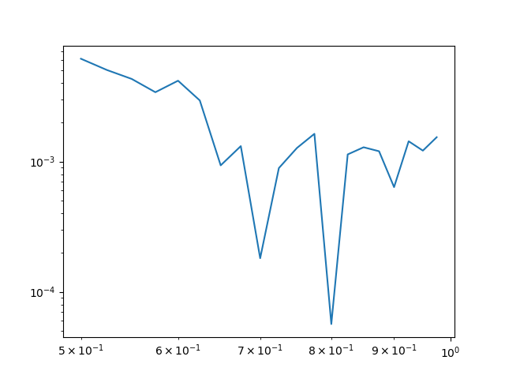

# Отчет по лабораторной работе №N по Мат Моделированию

## 1-2. Содержательная постановка задачи

Объект исследования - вероятностные методы вычисления числа $\pi$.

Практическая задача - определения числа $\pi$ методом Монте-Карло и с помощью задачи Бюффона о бросании иглы. А также исследование зависимости точности расчета числа $\pi$ от соотношения длины иглы к расстоянию между параллельными прямыми при равном количестве случайных бросков.

Входные параметры:

* $l$ - длина бросаемой иглы
* $L$ - расстояние между линиями на разлинованной поверхности
* $n$ - колличество точек на плоскости в методе монте-карло или количесво бросков иглы в методе буффона

## 3. Концептуальная постанока задачи

### Метод Монте - Карло

Суть метода в выборе выборе точки на квадратном участке плоскости длинны $R$. Какова вероятность попасть в окружность (или четверть окружности), с центром $(\frac{R}{2};\frac{R}{2}$) и радиусом $\frac{R}{2}$ ?

Этот метод применяется при расчете числа $\pi$, чем больше кол-во итераций, тем точнее результат.

### Задача Бюффона

Суть метода в бросании иглы длиной l на плоскость, расчерченную параллельными прямыми, расположенными на расстоянии a друг от друга. Какова вероятность того, что игла пересечет одну из параллельных прямых?

Этот метод также применяется для вычисления числа π. Чем больше количества повторений опыта, тем точнее будет результат.

Будем считать иглу – отрезком, пренебрегая ее толщиной.
Так как падение иглы на любой участок поверхности – событие равновероятное, ограничимся рассмотрением участка плоскости, заключенного между двумя прямыми.
Для решения задачи воспользуемся геометрической вероятностью.

## 4. Математическая постановка задачи

### Метод монте-карло


Эксперемнт проводится путем многократной генерации 2 случайных чисел x,y (генератор основан на равномерном распределении с параметрами R(0,1) в случае четверти окружности и R(-1,1) в случае полной окружности) и проверки, попадает ли точка с координатами (x,y) внутрь окружности.

Вероятность попасть в область внутри окружности равна $\frac{\pi}{4}$ (как для области в четверть окружности, так и для полной)

Конечный результат вычисляется по формуле $\frac{R*4}{N}$, где $R$ - кол-во точек, попавших внутрь окружности, а $N$ кол-во сгенерированных точек

### Метод Бюффона

На плоскость, разграниченную параллельными прямыми, отстоящими друг от друга на расстояние $L$, наудачу бросается игла диной $l \,\,(l ≤ L)$. Найдем вероятность события $A$ = {игла пересечет какую-либо из прямых}. Будем описывать положение иглы двумя координатами: углом $\alpha$ между иглой и прямыми и расстоянием $d$ от центра иглы до ближайшей прямой.

Тогда опыт можно представить как случайный выбор упорядоченной пары чисел $(\alpha, d)$, т.е. элементарные исходы $\omega=(\alpha, d)∈R^2$.
Пространство элементарных исходов:
$\Omega=\{(\alpha, d)|0 \leq \alpha\leq \frac{\pi}{2},0 \leq d\leq \frac{L}{2}  \}$
событие $A=\{(\alpha, d)|0 \leq \alpha\leq \frac{\pi}{2},0 \leq d\leq \frac{l}{2}sin(\alpha)  \}$

очевидно, что 
$mes(\Omega)=\pi L$
$mes(A)=\int\limits^\frac{\pi}{2}_0d\alpha\int\limits^{\frac{l}{2}sin(\alpha)}_0d d=\frac{l}{2}$,
поэтому $P(A)= \frac{2l}{\pi d}$, откуда $\pi=\frac{2l}{P(A)*L}$

Эксперемнт проводится путем многократной генерации 2 случайных чисел $d$,$\alpha$ (генератор для $d$ основан на равномерном распределении с параметрами $R(0,L)$ генератор для $\alpha$ основан на $R(0,\frac{\pi}{2})$) и проверки, пересекла ли игла длины $l$ одну из линий на разлинованой плоскости. Условие, при котором мы считаем, что игла пересекла одну из линий: $d/2<l *sin(\alpha)/2$

Так как вероятность пересечения иглой линии теоретически равна $P=\frac{2*L}{\pi*l}$, то для приближенного вычисления числа $\pi$ можем использовать формулу $\pi=\frac{2L}{lP}$, или $\pi=\frac{2LN}{lM}$, где N - кол-во бросков, а M - кол-во пересечений иглой линий.
  
## 5. Реализация

```c++
#include <iostream>
#include <cuda_runtime.h>
#include <stdio.h>
#include <sys/time.h>
#include <curand.h>
#include <curand_kernel.h>
#include <thrust/reduce.h>
#include <thrust/device_vector.h>
#include <fstream>
#include <iomanip>
using namespace std;

#define R 1.0
#define PI 3.14159265358979323846


template<typename T> 
__global__ void monte_carlo(unsigned int * map,long long n,T*random_x,T*random_y){
    unsigned int ix= threadIdx.x + blockIdx.x * blockDim.x;
    unsigned int iy = blockIdx.y;
    if (ix < n && iy < n){
        unsigned int ind = iy*n + ix;
        //printf("\n%d ",ind);
        if(sqrt(pow(random_x[ind],2)+pow(random_y[ind],2)<=R)){
            map[ind]=true;
        }
        else
            map[ind]=false;
    }   
}

template<typename T>
__global__ void stretch(T* arr,long long n,T el0,T a){
    unsigned int ix= threadIdx.x + blockIdx.x * blockDim.x;
    unsigned int iy = blockIdx.y;
    if (ix < n && iy < n){
        unsigned int ind = iy*n + ix;
        arr[ind]=arr[ind]*a+el0;
        //printf("%d %lf ",ind ,arr[ind]);
    }   
}

template<typename T>
__global__ void kernel_buffon(unsigned int * map,long long n,T*random_d,T*random_alpha,T l){
    unsigned int ix= threadIdx.x + blockIdx.x * blockDim.x;
    unsigned int iy = blockIdx.y;
    if (ix < n && iy < n){
        unsigned int ind = iy*n + ix;
        if(random_d[ind]/2<l*sin(random_alpha[ind])/2){
            map[ind]=true;
        }
        else{
            map[ind]=false;
        }
    }   
}

long double quarter_monte_carlo(long long n){
    srand(time(0));
    dim3 block(1024);
    dim3 grid((n + block.x - 1) / block.x);

    curandGenerator_t gen1;
    curandGenerator_t gen2;

    float *random_x, *random_y;
    unsigned int * map_gpu;

    cudaMalloc((void **)&random_x, n*sizeof(float)); 
    cudaMalloc((void **)&random_y, n*sizeof(float)); 
    cudaMalloc((void **)&map_gpu, n*sizeof(unsigned int));
    curandCreateGenerator(&gen1, CURAND_RNG_PSEUDO_XORWOW);
    curandCreateGenerator(&gen2, CURAND_RNG_PSEUDO_XORWOW);
    curandSetPseudoRandomGeneratorSeed(gen1, rand()); 
    curandSetPseudoRandomGeneratorSeed(gen2, rand()); 

    // create random arrays x and y
    curandGenerateUniform(gen1, random_x, n); // x
    curandGenerateUniform(gen2, random_y, n); // y

    monte_carlo<<<grid,block>>>(map_gpu,n,random_x,random_y); // do paralell 

    thrust::device_ptr<unsigned int> first(map_gpu);
    thrust::device_ptr<unsigned int> last(map_gpu+n);
    long double res=thrust::reduce(first, last);
    curandDestroyGenerator(gen1);
    curandDestroyGenerator(gen2);

    cudaFree(random_x);
    cudaFree(random_y);
    cudaFree(map_gpu);
    return res/n*4;
}

long double full_monte_carlo(long long n){
    srand(time(0));
    dim3 block(1024);
    dim3 grid((n + block.x - 1) / block.x);

    curandGenerator_t gen1;
    curandGenerator_t gen2;

    float *random_x, *random_y;
    unsigned int * map_gpu;

    cudaMalloc((void **)&random_x, n*sizeof(float)); 
    cudaMalloc((void **)&random_y, n*sizeof(float)); 
    cudaMalloc((void **)&map_gpu, n*sizeof(unsigned int));
    curandCreateGenerator(&gen1, CURAND_RNG_PSEUDO_XORWOW);
    curandCreateGenerator(&gen2, CURAND_RNG_PSEUDO_XORWOW);
    curandSetPseudoRandomGeneratorSeed(gen1, rand()); 
    curandSetPseudoRandomGeneratorSeed(gen2, rand()); 

    // create random arrays x and y
    curandGenerateUniform(gen1, random_x, n); // x
    curandGenerateUniform(gen2, random_y, n); // y
    stretch<<<grid,block>>>(random_x,n,-1.0f,2.0f);
    stretch<<<grid,block>>>(random_y,n,-1.0f,2.0f);
    monte_carlo<<<grid,block>>>(map_gpu,n,random_x,random_y); // do paralell 
 

    thrust::device_ptr<unsigned int> first(map_gpu);
    thrust::device_ptr<unsigned int> last(map_gpu+n);

    long double res=thrust::reduce(first, last)  ;
    //cout<<res<<endl;
    curandDestroyGenerator(gen1);
    curandDestroyGenerator(gen2);

    cudaFree(random_x);
    cudaFree(random_y);
    cudaFree(map_gpu);
    return res/n*4;
}

long double buffon(long long n,float l,float L){
    srand(time(0));
    dim3 block(1024);
    dim3 grid((n + block.x - 1) / block.x);
    curandGenerator_t gen2,gen3;

    float  *random_d,*random_alpha;
    unsigned int * map_gpu;
    
    cudaMalloc((void **)&random_d, n*sizeof(float)); 
    cudaMalloc((void **)&random_alpha, n*sizeof(float)); 
    cudaMalloc((void **)&map_gpu, n*sizeof(unsigned int));
    curandCreateGenerator(&gen2, CURAND_RNG_PSEUDO_XORWOW);
    curandCreateGenerator(&gen3, CURAND_RNG_PSEUDO_XORWOW);
    curandSetPseudoRandomGeneratorSeed(gen2, rand()); 
    curandSetPseudoRandomGeneratorSeed(gen3, rand()); 

    // create random arrays x and y
    curandGenerateUniform(gen2, random_d, n); // y
    curandGenerateUniform(gen3, random_alpha, n); // alpha

    stretch<<<grid,block>>>(random_alpha,n,0.0f,float(PI/2));
    cudaDeviceSynchronize();    
    stretch<<<grid,block>>>(random_d,n,0.0f,L);
    cudaDeviceSynchronize();    

    kernel_buffon<<<grid,block>>>(map_gpu,n,random_d,random_alpha,l); // do paralell 
    cudaDeviceSynchronize();    


    thrust::device_ptr<unsigned int> first(map_gpu);
    thrust::device_ptr<unsigned int> last(map_gpu+n);

    long double res=thrust::reduce(first, last);
    curandDestroyGenerator(gen3);
    curandDestroyGenerator(gen2);

    cudaFree(random_d);
    cudaFree(random_alpha);
    cudaFree(map_gpu);
    return 2.0f*l*float(n)/res/L;
}

template<typename T> 
void write(T* err,long long * N,int n,string filename){
    ofstream out;
    string name="../TextFiles/"+filename+".txt";
	out.open(name);
	if (out.is_open()) {
        for (int k = 0; k <n; k++){
            out << setprecision(20) << N[k] << " " << setprecision(20) << err[k] << endl;
        }
	}
	else {cout<<"Error while writing"<<endl;}
	out.close();
}

template<typename T> 
void write(T* err,T * N,int n,string filename){
    ofstream out;
    string name="../TextFiles/"+filename+".txt";
	out.open(name);
	if (out.is_open()) {
        for (int k = 0; k <n; k++){
            out << setprecision(20) << N[k] << " " << setprecision(20) << err[k] << endl;
        }
	}
	else {cout<<"Error while writing"<<endl;}
	out.close();
}

int main(){
    long long n=pow(2,28);
    long long n2=1;
    long long N=n*n2;
    long double pi=0;
    
    printf("number of iterations = %lld\n",N);
    
    for (size_t i = 0; i < n2; i++)
        pi+=quarter_monte_carlo(n);    
    printf("Pi quarter = %.16Lf, error = %.16Lf\n",pi/n2,abs(PI-pi/n2));
    

    
    pi=0;
    for (size_t i = 0; i < n2; i++)
        pi+=full_monte_carlo(n);
    printf("Pi full    = %.16Lf, error = %.16Lf\n",pi/n2,abs(PI-pi/n2));
    
    
    int n3=28;
    long long*N_=new long long[n3-8];
    long double *arr=new long double[n3-8];
    for(int k=0;k<n3-8;k++){
        pi=0;
        n=pow(2,k+8);
        for (size_t i = 0; i < n2; i++)
            pi+=buffon(n,0.78f,1.0f);
        arr[k]=abs(PI-pi/n2);
        N_[k]=n;
    }
    write(arr,N_,n3-8,"buffon1");


    n3=20;
    n=pow(2,20);
    long double *frac=new long double[n3];
    for(int k=0;k<n3;k++){
        pi=0;
        float l=0.5+0.025*k;
        for (size_t i = 0; i < n2; i++)
            pi+=buffon(n,l,1.0f);
        arr[k]=abs(PI-pi/n2);
        frac[k]=l;
    }
    write(arr,frac,n3,"buffon2");

    delete[] N_;
    delete[]arr;
    delete[]frac;

    return 0;
}
```


## 7. Численное иследование модели

### Метод Монте-Карло

``` bash
number of iterations = 268435456
Pi quarter = 3.1414559632539749, error = 0.0001366903358182
Pi full    = 3.1415733397006989, error = 0.0000193138890943
```

### Задача Бюффона

1) Зависимость точности расчёта от числа бросков


2) Зависимость точности расчёта от отношения длины иглы к расстоянию между прямыми
 

