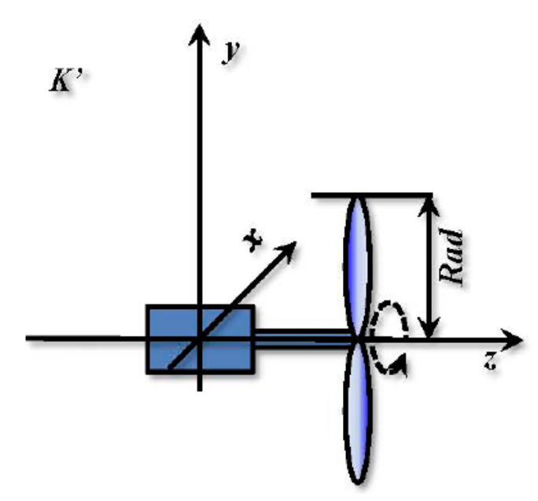
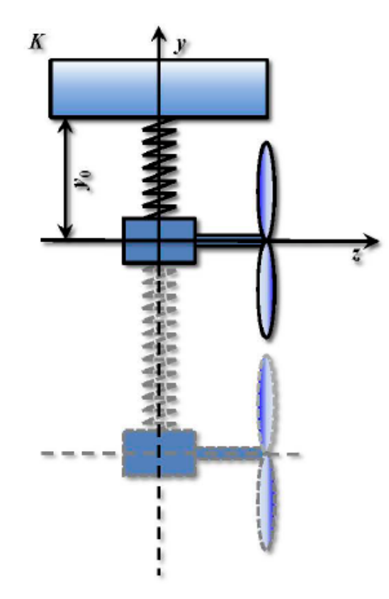
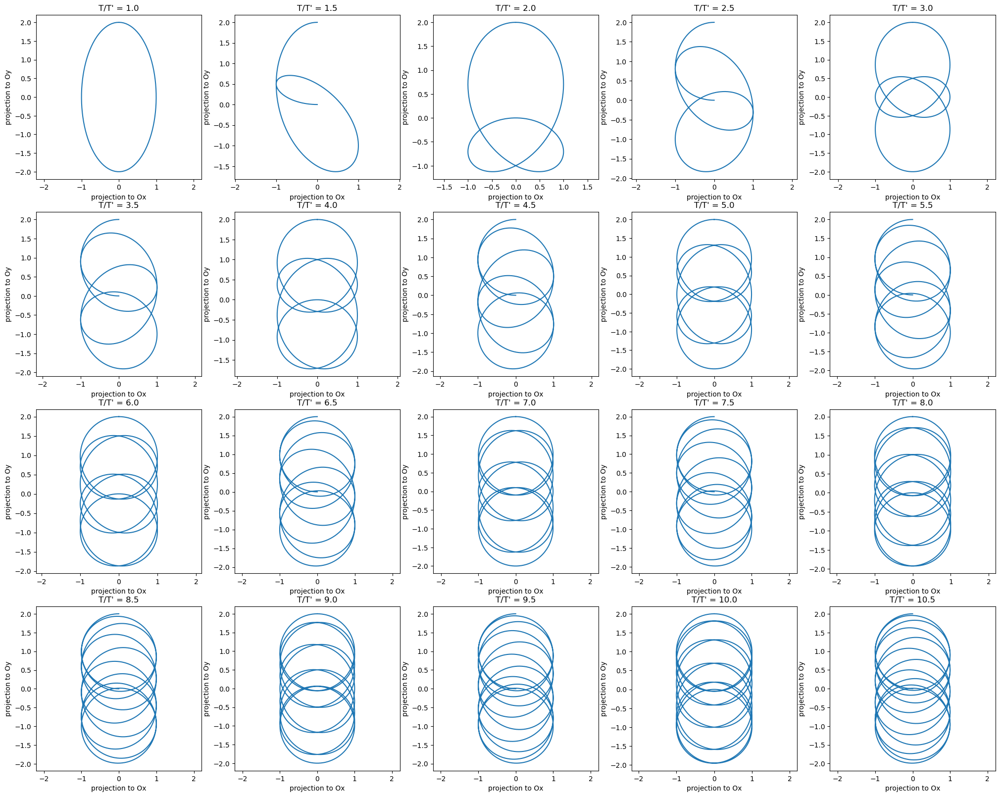

# Отчет по лабораторной работе №7 по Мат Моделированию

## 1-2. Содержательная постановка задачи

1. Построить модель траектории концов лопастей вентилятора;
2. Найти при каких соотношениях периода вращения лопастей и периода колебаний пружинного маятника траектория концов лопастей соответствует фигуре Лиссажу.

## 3. Концептуальная постанока задачи

Рассмотрим вращающийся вентилятор, подвешенный на пружине.  Масса вентилятора вместе с подвесом – $m$. Вентилятор, подвешенный на упругой пружине с жесткостью $k$.  Лопасти вентилятора движутся по окружности заданного радиуса $R$ с периодом $T$.

Применим следующие гипотезы:

* Абсолютность времени во всех системах отсчета как инерциальных, так и неинерциальных

* Считаем вентилятор с подвесом материальной точкой

## 4. Математическая постановка задачи

Для нахождения траекторий относительных движений в классической механике используется предположение об абсолютности времени во всех системах отсчета, как инерциальных, так и неинерциальных. Рассмотрим движение одной и той же точки в двух различных системах отсчета $К$ и $К'$. Система отсчета $К'$ связана с осью вращения вентилятора и центром тяжести системы вентилятор-подвес. Лопасти вращаются в плоскости $xy$.



Система отсчета $К$ связана с центром тяжести системы вентилятор-подвес. Движение системы происходит в плоскости $уz$. Расстояние от точки подвеса до центра тяжести системы вентилятор-подвес в состоянии равновесия соответствует $y0$.



Радиус-вектор $r'(t)$ описывает движение точки в системе отсчёта $K'$, движение системы отсчета $K'$ относительно $K$ задается радиус-вектором $R(t)$ Тогда движение заданной точки относительно системы отсчета K описывается радиус-вектором $r(t)=r'(t)+R(t)$

В системе K согласно закону Ньютону и закону Гука движение материальной точкой массой описывается дифференциальным уравнением:

```math
\begin{cases}
\frac{\partial^2 R}{\partial t^2}m=-ky\\
t_0=0\\
\frac{\partial R}{\partial t}|_{t=0}=0\\
R(t_0)=y_0
\end{cases}
```

Решение уравнения с данными начальными условиями принимает вид:

$R(t) = y_0 cos(2\pi/T)$, где $T = 2π\sqrt{ \frac{m}{k}}$

Лопасти вентилятора движутся по окружности заданного радиуса $R$ с периодом $T'$ Координаты радиус-вектора концов лопастей вентилятора в системе отсчета $K'$ , связанной с центром, вокруг которого вращаются лопасти, изменяются по закону:

```math
r'(t)=
\begin{cases}
r'_x=R*cos(\frac{2\pi}{T'}t+\phi_0)\\
r'_y=R*sin(\frac{2\pi}{T'}t+\phi_0)
\end{cases}
```

Тогда траектория движения концов лопастей вентилятора, подвешенного на пружине, описывается радиус-вектором:

```math
r(t)=
\begin{cases}
r'_x=R*cos(\frac{2\pi}{T'}t+\phi_0)\\
r'_y=R*sin(\frac{2\pi}{T'}t+\phi_0)+y_0 cos(2\pi/T)
\end{cases}
```

## 5. Реализация

```python
import numpy as np
import matplotlib.pyplot as plt

def rx(t,R,T_rot,phi0):
    return R*np.cos(2*np.pi/T_rot*t+phi0) 

def ry(t,R,T_rot,phi0,T_spring,y0):
    return R*np.sin(2*np.pi/T_rot*t+phi0) + y0*np.cos(t*2*np.pi/T_spring)

R=1
phi=np.pi/2
T=1
a=T*np.arange(1,11,0.5)

i=1
plt.figure(figsize=(25,25))
for T1 in a:
    t_max=T1
    t=np.linspace(0,t_max,int(t_max*100))
    T_spring=T1
    T_rot=T
    phi=np.pi/2
    x = rx(t,R,T_rot,phi)
    y = ry(t,R,T_rot,phi,T_spring,1)
    plt.subplot(5,5,i)
    i+=1
    plt.plot(x,y)
    plt.axis('equal')
    plt.xlabel('projection to Ox')
    plt.ylabel('projection to Oy')
    plt.title(f"{T_spring/T_rot}")
```

## 7. Численное иследование модели



Фигуры Лиссажу получаются, когда траектория лопастей замкнута, тоесть исходя из рисунка, когда отношение периодов чётно