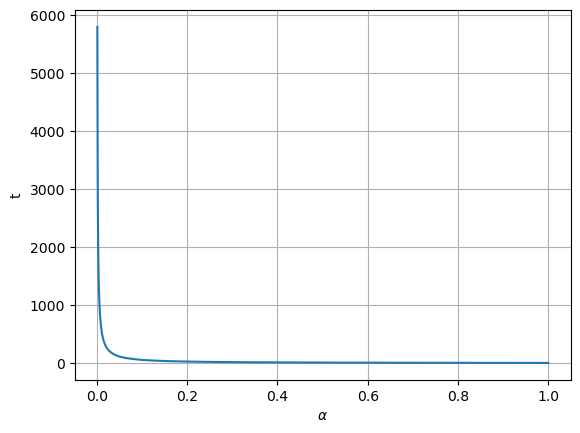
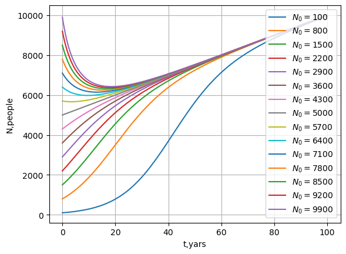
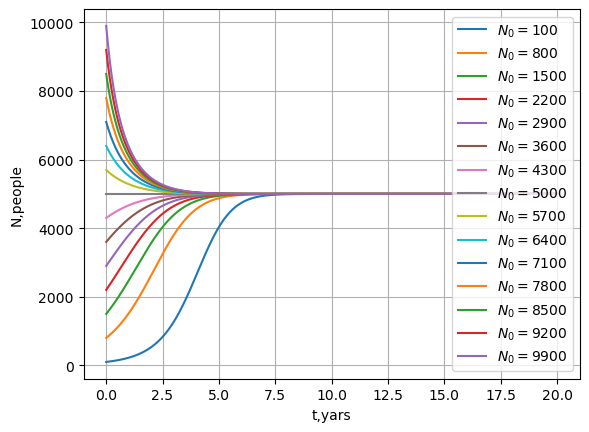

# Отчет по лабораторной работе №8 по Мат Моделированию

## 1-2. Содержательная постановка задачи

Разработка математической модели, способной выражать зависимость
численности населения Земли в зависимости от времени так, чтобы полученная модель
адекватно отражала численность народонаселения Земли в прошлом.
**Задачи:**

1) Зависимость численности народонаселения при условии, что «равновесная»
численность популяции линейно изменяется со временем.

2) Зависимость численности народонаселения при условии, что коэффициент пророста
населения экспоненциально изменяется со временем.

## 3. Концептуальная постанока задачи

Будем считать, что:

* Существует «равновесная» численность популяции которую может обеспечить
окружающая среда т.е. производство продовольствия;
* Скорость изменения численности популяции пропорциональна самой численности,
умноженной на величину её отклонения от равновесного значения

## 4. Математическая постановка задачи

Рассмотрим уравнение 
$$
\frac{d N(t)}{d t}=\alpha(t) (1-\frac{N(t)}{N_p(t)})N(t), \,\, \alpha(t)>0
$$

Член $(1-\frac{N(t)}{N_p(t)})$ обеспичивает механихм "насыщения" численности: 
при $N(t)<N_p(t)$ ($N(t)>N_p(t)$) скорость роста положительна (отрицательна)
и стремится к нулю, если $N(t)\rightarrow N_p(t)$

Перепишем уравнение и затем проинтегрируем:

$$\frac{d N(t)}{N_p(t)-N(t)}+\frac{d N(t)}{N(t)}=\alpha$$


$$ln(\frac{N(t)}{N_p(t)-N(t)})=\alpha t+C$$

Пусть $N(t_0)=N_0$, $N_p(t_0)=N_{p0}$, и $\alpha(t_0)=\alpha_0$, тогда $C=ln(\frac{N_0}{N_{p0}-N_0})$

Тогда:
$$N(t)=\frac{N_p(t)N_0e^{\alpha t}}{N_{p0}-N_0(1-e^{\alpha t})}$$ 


В случае, если $\alpha$ экспоненциально зависит от времени, то получаем:

$$N(t) = \frac{N_p(t)N_0e^{ck(\alpha(t)-\alpha_0)}}{N_p(t)-N_0(1-e^{ck(\alpha(t)-\alpha_0)})}$$
## 5. Реализация

### 1.2

```python
def people2(t,alpha,Np,N0,Np0):
    T=0
    for t_ in t:
        if  Np*N0*np.exp(alpha*t_)/(Np0-N0*(1-np.exp(alpha*t_)))>Np0/2:
            T=t_
            break
    return T

t_max=10000
alpha=np.linspace(0,1,1000)
t=np.linspace(0,t_max,10000)
Np,Np0=5000,5000
N0=15
T=np.zeros(len(alpha))
for i,a in enumerate(alpha):
    T[i]=people2(t,a,Np,N0,Np0)

plt.plot(alpha[1:],T[1:])
plt.xlabel(r'$\alpha$')
plt.ylabel('t')
plt.grid()
```

### 2.1
```python
def people(t,alpha,Np,N0,Np0):
    return Np*N0*np.exp(alpha*t)/(Np0-N0*(1-np.exp(alpha*t)))

t_max=100
alpha=0.1
N=np.arange(100,10000,700)
t=np.linspace(0,t_max,1000)

Np0=5000
for n in N: 
    N0=n
    Np=Np0+t*50
    N_=people(t,alpha,Np,N0,Np0)
    plt.plot(t,N_,label=f'$N_0 = ${N0}')

plt.legend()
plt.xlabel('t,yars')
plt.ylabel('N,people')
plt.grid()
```

### 2.2

```python
t_max=20
alpha_0=0.5
c=0.5
k=2
N=np.arange(100,10000,700)
Np0=5000
t=np.linspace(0,t_max,1000)
for i,n in enumerate(N): 
    N0,Np=n,Np0
    alpha=np.exp(c/k*(alpha_0/k*t-alpha_0))
    N_=people(t,alpha,Np,N0,Np0)
    plt.plot(t,N_,label=f'$N_0 = ${N0}')

plt.legend(loc='right')
plt.xlabel('t,yars')
plt.ylabel('N,people')
plt.grid()
```

## 7. Численное иследование модели

### 1.2 График зависимости времени достижения равновестной популяции от $\alpha$


### 2.1 График зависимости численности народонаселения от времени при условии, что $N_p$ линейно зависит от времени



### 2.2 График зависимости численности народонаселения от времени при условии, что $alpha$ экспоненциально зависит от времени

