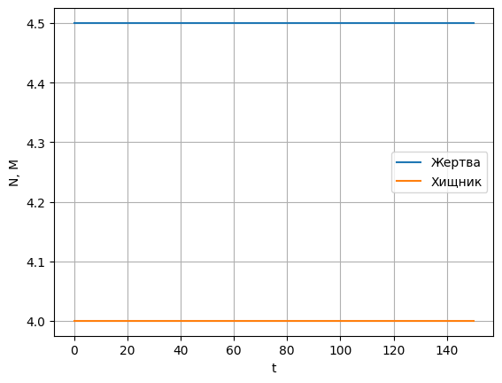
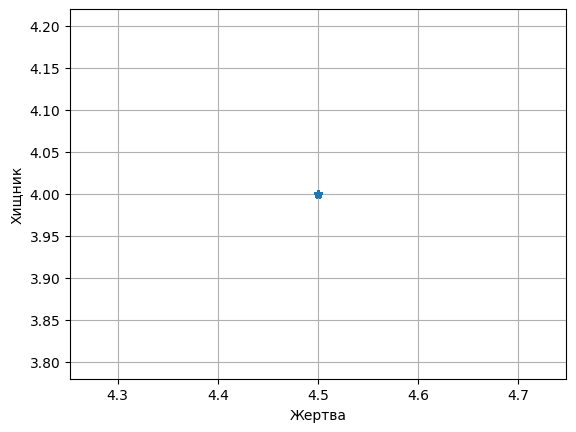
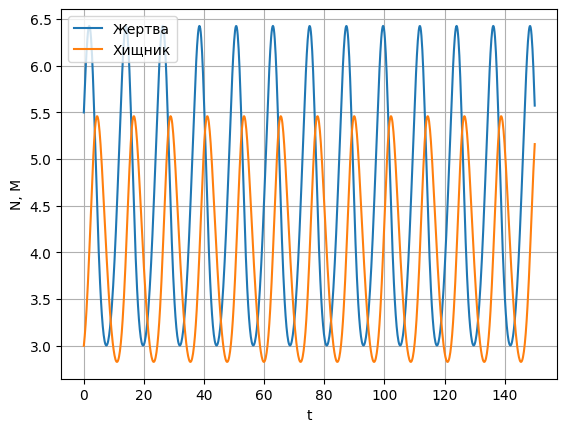
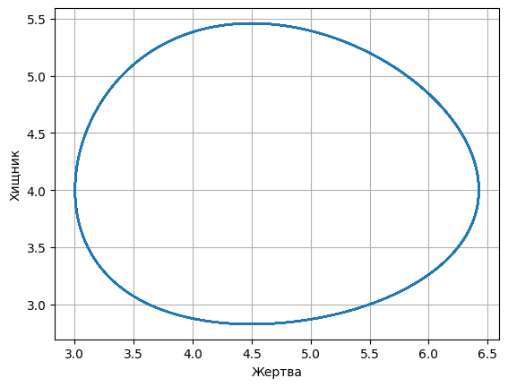
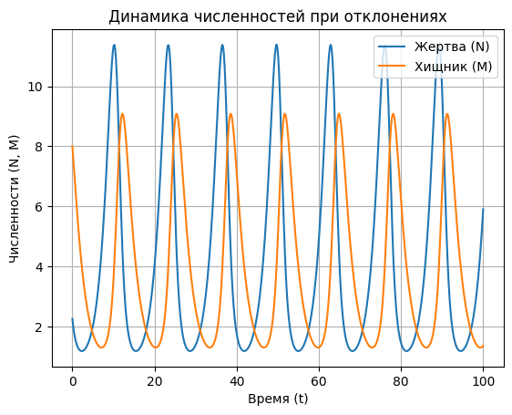
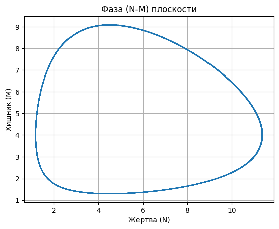

# Отчет по лабораторной работе №9 по Мат Моделированию

## 1-2. Содержательная постановка задачи
## 1.1
Суть поставленной задачи:
Проанализировать, если начальные численности в точности равны величинам $M_0$ и $N_0$, то как с течением времени они изменяются, а также если по каким-то причинам численности ненамного отклоняются от величин $M_0$ и $N_0$, то вернется ли система в положение равновесияю.
## 1.2
Суть поставленной задачи:
Проанализировать, если начальные значения $M_0$ и $N_0$ заметно отличаются от равновесных, то каким образом они меняются со временем относительно величин $M_0$ и $N_0$, а также вычислить период колебаний в системе "хищник-жертва" в зависимости от ее характеристик ($\alpha$,$\beta$,C1,C2) и начального состояния $M_0$ и $N_0$.

## 3. Концептуальная постанока задачи
## 3.1 3.2
Математическая модель наиболее простой, т.е. двувидовой системы «хищник – жертва» основывается на следующих предположениях:
1.	Численности популяций жертв N и хищников М зависят только от времени (точечная модель, не учитывающая пространственное распределение популяции на занимаемой территории).
2.	В отсутствие взаимодействия численность видов изменяется по модели Мальтуса при этом число жертв увеличивается, а число хищников падает, так как им в этом случае нечем питаться:
$\frac{dN}{dt}=a_N N$, $\frac{dM}{dt}=a_M M$, $a_N>0$, $a_M>0$.
3.	Естественная смертность жертвы и естественная рождаемость хищника считаются несущественными.
4.	Эффект насыщения численности обеих популяций не учитывается.
5.	Скорость роста численности жертвы уменьшается пропорционально численности хищников, т.е. величине $C_1 M>0$, ($C_1>0$), а темп роста хищников увеличивается пропорционально численности жертвы, т. е. величине $C_2 N(C_2>0)$

## 4. Математическая постановка задачи
## 4.1 4.2
Объединяя предположения (1) – (5), приходим к системе уравнений Лотки – Вольтерра:
$$ 
\left\{
\begin{array}{l}
\frac{dN(t)}{dt} = (\alpha - C_1 M)N(t) \\
\frac{dM(t)}{dt} = (-\beta - C_2 N)M(t)
\end{array}
\right.
$$ 

из которой по начальным численностям $N(t_0) =N_0$, $M(t_0)=M_0$ определяется численность популяции в любой момент t>0.
Нелинейную систему удобно исследовать в плосксти переменных N,M для чего первое уравнения поделим на второе :
$\frac{dN(t)}{dM(t)}=\frac{(\alpha - C_1 M)N(t)}{(-\beta+C_2 N)M(t)}$.
Уравнения имеют положения равновесия(или стационарное, не зависящее от времени решение) $M_0=\frac{\alpha}{C_1}$, $N_0=\frac{\beta}{C_2}$


## 5. Реализация
## 5.1
```python
import numpy as np
import matplotlib.pyplot as plt
from scipy.integrate import odeint

alpha = 0.6
beta = 0.45
C1 = 0.15
C2 = 0.1

N0 = beta / C2
M0 = alpha / C1

def ode_N_M(N_M, t):
    N, M = N_M
    dN = (alpha - C1 * M) * N
    dM = (-beta + C2 * N) * M
    return [dN, dM]

def calculation(Nt_0, Mt_0, style):
    t = np.linspace(0, 150, 1000)
    initial_conditions = [Nt_0, Mt_0]


    N_M = odeint(ode_N_M, initial_conditions, t)
    plt.figure()
    plt.plot(t, N_M[:, 0], label='Жертва')
    plt.plot(t, N_M[:, 1], label='Хищник')
    plt.xlabel('t')
    plt.ylabel('N, M')
    plt.legend()
    plt.grid()

    plt.figure()
    plt.plot(N_M[:, 0], N_M[:, 1], style)
    plt.xlabel('Жертва')
    plt.ylabel('Хищник')
    plt.grid()
    plt.show()


Nt_0 = N0
Mt_0 = M0
calculation(Nt_0, Mt_0, '*')


Nt_0 = N0 + 1
Mt_0 = M0 - 1
calculation(Nt_0, Mt_0, '')

```
## 5.2
```python
import numpy as np
import matplotlib.pyplot as plt
from scipy.integrate import odeint

alpha = 0.6
beta = 0.45
C1 = 0.15
C2 = 0.1

N0 = beta / C2
M0 = alpha / C1

def model(N_M, t):
    N, M = N_M
    dNdt = (alpha - C1 * M) * N
    dMdt = (-beta + C2 * N) * M
    return [dNdt, dMdt]

def calculation(Nt_0, Mt_0):
    t = np.linspace(0, 100, 500)
    N_M0 = [Nt_0, Mt_0]
    N_M = odeint(model, N_M0, t)

    plt.figure()
    plt.plot(t, N_M[:, 0], label='Жертва (N)')
    plt.plot(t, N_M[:, 1], label='Хищник (M)')
    plt.xlabel('Время (t)')
    plt.ylabel('Численности (N, M)')
    plt.legend()
    plt.grid()
    plt.title('Динамика численностей при отклонениях')
    plt.show()

    plt.figure()
    plt.plot(N_M[:, 0], N_M[:, 1])
    plt.xlabel('Жертва (N)')
    plt.ylabel('Хищник (M)')
    plt.title('Фаза (N-M) плоскости')
    plt.grid()
    plt.show()

calculation(N0 * 0.5, M0 * 2)  

def calculate_period(C1, C2):
    return 2 * np.pi * np.sqrt(1 / (C1 * C2*M0*N0))

period = calculate_period(C1, C2)
print(f"Период колебаний системы: {period:.2f}")

```


## 7. Численное иследование модели
## 7.1





## 7.2



Период колебаний системы: 12.09
